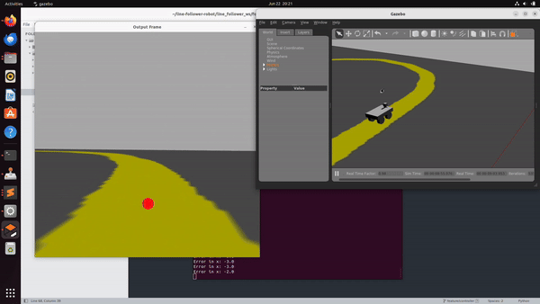

# Line Follower Robot

- [Introduction](#introduction)
- [Overview](#overview)
    - [Folder Structure](#folder-structure)
    - [Folder Annotation](#folder-annotation)
- [Installation](#installation)
- [Code Explanation](#code-explanations)
- [Dependencies](#dependencies)
- [Conclusion](#conclusion)

## Introduction

This repository contains the implementation of a line-following algorithm for a four-wheel robot integrated with ROS. The robot uses a differential motion model and relies on a camera to capture the line it needs to follow, adjusting its movement based on the line's position.



## Overview

This section contains some definition about the general architecture/structure of the project and the responsibility of each item. 

### Folder Structure

Following folder tree shows how our repo structures
```
.
├── docker
│   ├── 10_nvidia.json
│   ├── build_docker.sh
│   ├── Dockerfile
│   ├── install_docker.sh
│   ├── into_docker.sh
│   ├── README.md
│   ├── req
│   │   ├── build.bash
│   │   └── workspace_building.bash
│   └── run_docker.sh
├── docs
│   
├── line_follower_ws
│   ├── build.bash
│   ├── devel
│   ├── follow_line.py
│   └── src
│       ├── CMakeLists.txt
│       ├── line_follower
│       │   ├── CMakeLists.txt
│       │   ├── course.material
│       │   ├── course.png
│       │   ├── course.world
│       │   ├── launch
│       │   │   ├── course.launch
│       │   │   └── gazebo_motor.launch
│       │   └── package.xml
│       └── quad_wheel_robot_6
│           ├── CMakeLists.txt
│           ├── config
│           │   ├── diffdrive.yaml
│           │   ├── gazebo_ros_control_params.yaml
│           │   └── joints.yaml
│           ├── meshes
│           │   └── base_link.STL
│           ├── package.xml
│           └── urdf
│               └── quad_wheel_robot_6_motor.urdf
└── Readme.md
```

### Folder Annotation

- `docker`: Containing docker setup for this implementation
- `docs`: Contain detail documents
- `line_follower_ws`: catkin working space 
    + `build.bash`: source this file every time import new packages.
    + `devel`: this folder contain built results.
    + `follow_line.py`: main file of the controller and observation logics.
    + `src/line_follower`: main package contains line-world and a ensemble launch file for both world and robot spawner.
    + `src/quad_wheel_robot_6`: package contains config, geometry, controllers, ... related to 4 wheel robot simulation.


## Installation

First, make sure you have a Docker instalattion running on your host machine. The Docker version used to develop this project was `24.0.4, build 3713ee1`. If you don't have Docker installed, please execute the command: 

```
sudo docker/install_docker.sh
```

After completing the Docker installation, the Docker image needs to be built. To do so, please run the command: 

```
sudo docker/build_docker.sh
```

As a result, an image called `ros-follower-img` should be created in your local Docker image list. Now for running the virtual Docker container, use the command: 

```
sudo docker/run_docker.sh
```

It will automatically get you to the bash terminal inside the Docker container. The first time you run the container, you have to build the workspace. For doing so, from the root path inside the container run: 

```
bash line_follower_ws/build.bash 
```

For launching and running the line follower robot in Gazebo run the following: 
Please execute following command to run our project.

```
roslaunch line_follower course.launch
```

Finally, for running the autonomous control algorithm, open a new terminal window, get inside the runnning Docker container and execute the algorithm script: 

```
sudo docker/into_docker.sh
python3 line_follower_ws/follow_line.py
```

## Code Explanations

A detailed code explanation of the different components of this project where full description, key variables, algorithmic steps, functions and examples are explained, can be found in the following links:

 - [URDF](./docs/urdf.md)
 - [Gazebo Settings](./docs/gazebo.md)
 - [Control Algorithm](./docs/algorithm.md)
 - [Launch File](./docs/launch_file.md)

## Dependencies 

Overall the tools used to develop the project are: 

- Docker (version 24.0.4, build 3713ee1)
- Ros (Distro: Noetic, Version: 1.16.0)
- Gazebo (version 11)
- Python (version 3.8.10)
- Solidworks (version 2023)

The Python libraries used are: 

- OpenCV
- Rospy
- Numpy 
- Pillow

## Conclusion

From the information written above, it's explained the process of how this autonomous system was built, what's the logic and the functions of each of its components and finally how to install and run for everyone with access to this repo. Some of its key points are: 

- Model and URDF configuration: for creating the vehicle with the given requirements.
- Gazebo World customization: to simulate and environment in which the robot should work.
- Launch File creation: to integrate custom components and launch with ROS and Gazebo.
- Control Algorithm: to integrate data coming from Gazebo and control the autonomous system.

We consider the task given successfully completed since all the steps below were fulfilled.

## Authors 

@huyhoang251296
@JorgeMedinaG