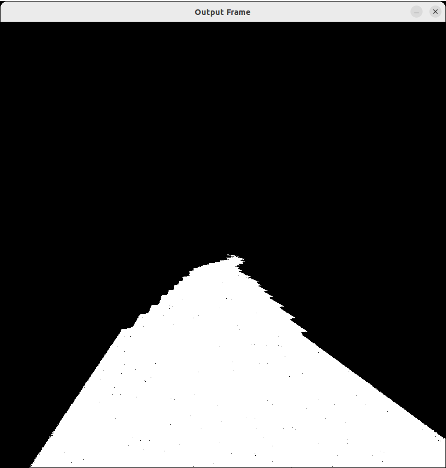
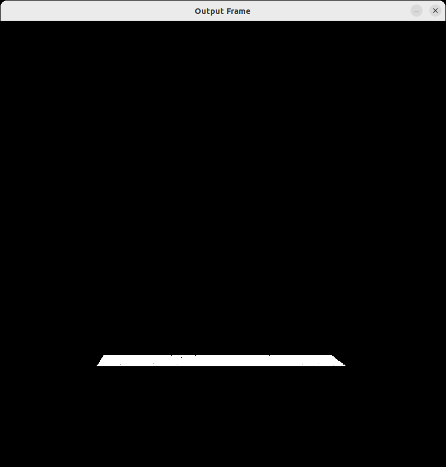
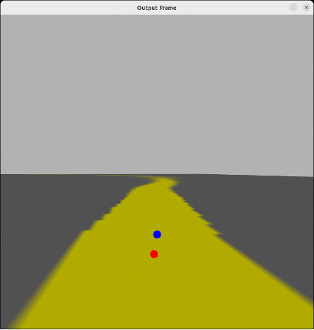
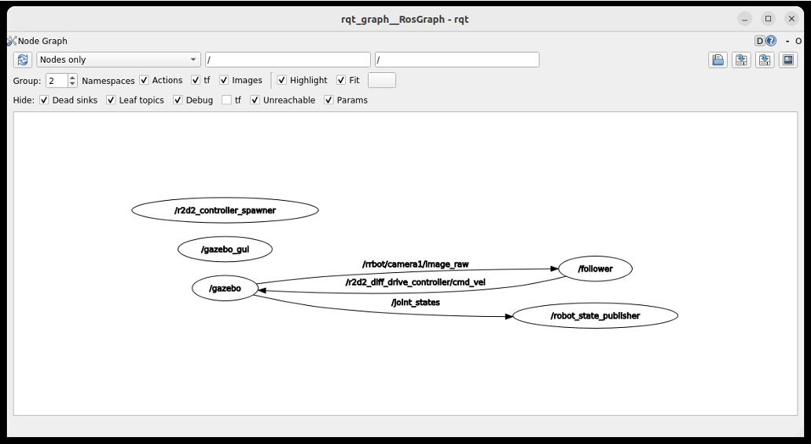

# Explanation for Control Algorithm

This file contains some explanation about the steps and logic used for the control of the line follower robot. 

This algorithm is built using Python with tools like `rospy` and `opencv`.

## Reading Sensor Data 

As explained on the URDF explanation docs, a camera is integrated as a sensor to the vehicle, which will be used to control the driving of the robot. 

The image data is published to the ROS Topic `/rrbot/camera1/image_raw' where a buffer with the raw image info is written and updated every time frame. To read and transform the image data to a format more usable the following steps are applied: 

1. Subscribe to the topic and pass a callback to be applied everytime the sensor information is updated.

```
rospy.Subscriber("/rrbot/camera1/image_raw", Image, self.image_transformation_cb)
```

2. The `image_transformation_cb` gets the raw data to a `PIL` image format and then its transformed to a `numpy` array stored in the instance variable `frame`.

```
  def image_transformation_cb(self, msg):
    im_h = msg.height
    im_w = msg.width

    img = PIL_Image.frombuffer('RGB', (im_h, im_w), msg.data)
    self.frame = np.array(img)
```

## Vehicle Control 

The four-wheel vehicle is designed with a differential drive system. To control the robot movement 2 variables are to be used: 

- Linear Velocity: Defines the velocity in `m/s` in which the robot is going to move in the 2D plane xy.
- Angular Velocity: Defines the velocity in `rad/s` in which the robot is going to turn around the z axis. 

For controlling the previously defined variables, the script publishes to the topic `/r2d2_diff_drive_controller/cmd_vel` the values of such variables. This is done in the following way: 

```
self.pub_cmd_vel = rospy.Publisher("/r2d2_diff_drive_controller/cmd_vel", Twist, queue_size=1, latch=False)
self.velocity = Twist()
```

```
self.velocity.linear.x = # your linear velocity value
self.velocity.angular.z = # your angular velocity value
self.pub_cmd_vel.publish(self.velocity)
```

## Image Processing 

With the input from the camera sensor, the goal is to find the center of the track to use it as the setpoint of the control. For doing so the following steps are executed: 


1. The image is converted to the HSV and RGB color spaces. 

```
frame_rgb = cv2.cvtColor(frame, cv2.COLOR_BGR2RGB)
frame_hsv = cv2.cvtColor(frame, cv2.COLOR_BGR2HSV)
```

2. The HSV format image, is used to filter the line track. Since the line track is yellow a mask is applied to detect the yellow items in the image. An upper and lowe bound for the yellow color is defined in the HSV color space and with the help of the `opencv` function `inRange` the yellow objects of the image are filtered. 

```
def get_color_mask(self, hsv):
    lower_yellow = np.array([ 50,  50, 170])
    upper_yellow = np.array([255, 255, 190])
    mask = cv2.inRange(hsv, lower_yellow, upper_yellow)
    return mask
```


<br>Result after applying the yellow filtering mask to the image.<br>

3. As we can see the results of the previous step produces a grayscale image with the yellow objects in it (track line) in white. Next step applied is to detect the track center, for this we focus the 'vision' of the robot in a specific part of the track and this is achieved by isolating a 20 pixel height section of the image below 3/4 of its height by setting the rest of the pixels outside the section to black. Then the `opencv` function `moments` is used to detect the boundaries of the reamining sections on the image.

```
def get_track_line_center(self, image, mask):
    h, w, d = image.shape
    search_top = 3*h//4
    search_bot = search_top + 20
    mask[0:search_top, 0:w] = 0
    mask[search_bot:h, 0:w] = 0

    M = cv2.moments(mask)
    if M['m00'] > 0:
        cx = int(M['m10']/M['m00'])
        cy = int(M['m01']/M['m00'])
        cv2.circle(image, (cx, cy), 20, (0,0,255), -1)
        cv2.circle(image, (w//2,cy-60), 10, (255, 0,0), -1)
        return cx, cy
    else: 
        return w//2, h//2
```


<br>Result after focusing on the specific section of the image.  
  

4. Finally for visualization purposes two dots are drawn on the RGB image: 
    - Red dot, representing the center of the line track. 
    - Blue dot, representing the center of the camera.




## Control Signal

With the results of the processing stage, the goal of the control algorithm is to keep the center point of the camera (center of the robot) aligned with the center of the line track. This way, we make sure the robot is always keeping it center inside the track. 

For achieving this, then a pixel error is computed between the two centers previously calculated and a proportional gain is applied to produced a angular velocity signal that corrects the difference between the two visual points. For this purpose, a constant linear velocity was used. Both values are then published to the ROS Topic. 

```
def calculate_control_output(self,cx, cy):
    h, w, d = self.frame.shape
    error = w/2 - cx
    return error * 0.005
```

```
angular_vel = self.calculate_control_output(cx, cy)
self.velocity.linear.x = 0.1
self.velocity.angular.z = angular_vel
self.pub_cmd_vel.publish(self.velocity)
```

## Running the Algorithm 

The Python script is integrated with ROS tools by bringing it up as a ROS Node. When you execute the file it will be registered as a Node and then a loop function which contains the steps previously described will be executed. 

```
if __name__ == '__main__': 
  rospy.init_node('follower')
  follower = Follower()
  follower.loop()
```




